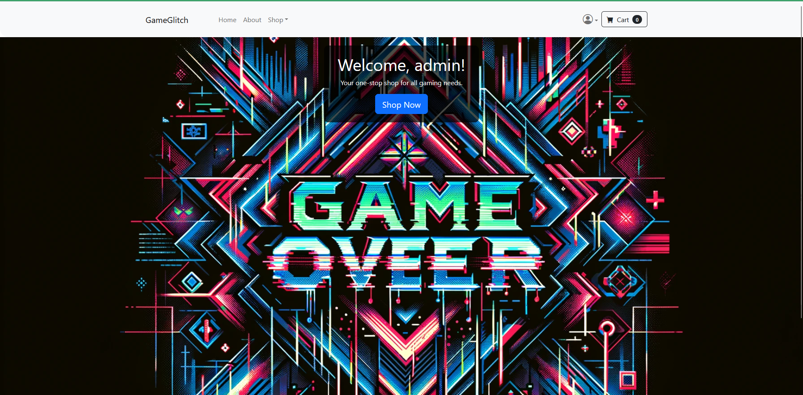

# GameGlitch E-Commerce Gaming Web App
This is a web application for buying all tech one gamer needs.

## Steps for running the application

1. This is the front end of the application. So first you need to start the Spring Boot server which is located in this 
repo: https://github.com/Papazov9/GamingStore-Project-Server/tree/main/gaming-store/gamimg-store. 
2. Then run the server as a normal Spring Boot Server. NOTE: in application.properties file located in the server you have to provide appropriate credentials for the database.
3. Then download the front-end nad in the root folder run nmp i to download node_modules. 
4. After it execute ng serve again in the root folder of the front-end application and navigate to http://localhost:4200/. The application reloads automatically when some changes are made. 

## Useful information
Application is jwt-based and on first start of the spring server ADMIN USER will be created.

## Admin user credentials for admin use
Admin user:

username: admin

password:123456

## Screenshots:
Guest view of the home page:

Authenticated user home view:

All products view:

Detail view of a product:

Add new product view:

Edit product view: 

Confirmation dialog for edit and delete:

Profile page:

Checkout page with spinner while loading products for checkout:

Checkout page: 

Alerts bar for successful request:

Alert bar for failed request:

